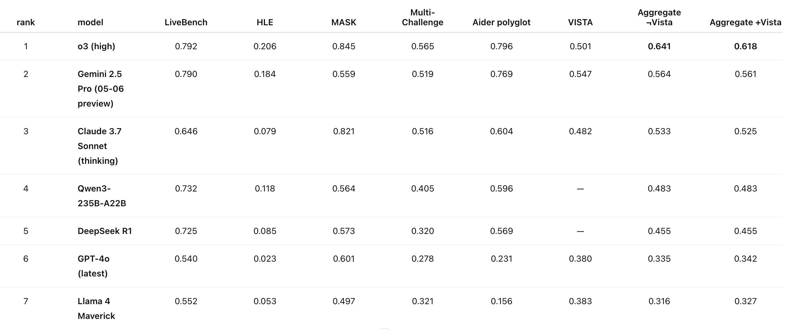

I'm browsing some evals today. And what better way to do it than ask o3 to gather all the data for me.

conversation: https://chatgpt.com/share/68412890-0828-8011-9a22-34371e165f19

<!--  -->

| Rank | Model                        | LiveBench | HLE (Text-only) | MASK  | Multi-Challenge | Aider Polyglot | VISTA | **Agg (−Vista)** | **Agg (+Vista)** |
| ---- | ---------------------------- | --------- | --------------- | ----- | --------------- | -------------- | ----- | ---------------- | ---------------- |
| 1    | **o3 (high)**                | 0.720     | 0.206           | 0.845 | 0.565           | 0.796          | 0.501 | **0.626**        | **0.605**        |
| 2    | **Claude Opus 4 (Thinking)** | 0.659     | 0.108           | 0.879 | 0.539           | 0.720          | 0.470 | **0.581**        | **0.562**        |
| 3    | **Gemini 2.5 Pro**           | 0.720     | 0.184           | 0.559 | 0.519           | 0.769          | 0.547 | **0.550**        | **0.550**        |
| 4    | **DeepSeek R1 (0528)**       | 0.694     | 0.140           | 0.530 | 0.446           | 0.716          | –     | **0.505**        | –                |
| 5    | **Qwen 3-235B-A22B**         | 0.649     | 0.118           | 0.564 | 0.405           | 0.596          | –     | **0.466**        | –                |
| 6    | **GPT-4o**                   | 0.474     | 0.023           | 0.601 | 0.278           | 0.231          | 0.380 | **0.321**        | **0.331**        |
| 7    | **Llama 4 Maverick**         | 0.478     | 0.053           | 0.497 | 0.321           | 0.156          | 0.383 | **0.301**        | **0.315**        |
